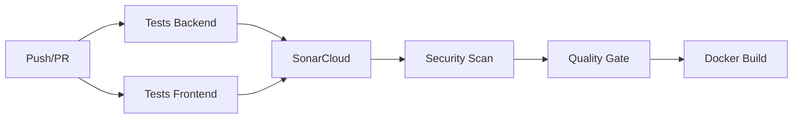

# MindEase v3 - Guide de Déploiement et Sécurisation

## 🎯 Vue d'Ensemble

Ce document présente l'implémentation complète des exigences de sécurisation et de déploiement pour le projet MindEase v3, conformément aux consignes du bloc 3 "Déployer et sécuriser les applications informatiques".

## 📋 Conformité aux Exigences

### ✅ Déploiement (10 points)
- **Environnements configurés** : Développement, Test, Production
- **Plan de déploiement** : Pipelines CI/CD automatisés avec GitHub Actions
- **Versioning** : Git/GitHub avec workflows automatisés

### ✅ Maintenance (11 points)
- **Gestion des évolutions** : GitHub Issues, Pull Requests, Semantic Versioning
- **Évolutivité** : Architecture microservices, monitoring Prometheus/Grafana
- **Méthodologie** : DevOps avec tests automatisés et quality gates

### ✅ Sécurisation (11 points)
- **Plan de sécurisation** : Modules de sécurité renforcée et conformité RGPD
- **Protection des données** : Chiffrement, anonymisation, politiques de rétention
- **Bonnes pratiques** : SonarQube, scans de sécurité, tests automatisés

## 🏗️ Architecture de Déploiement

### Environnements

#### 1. Développement Local
```bash
# Démarrage avec Docker Compose
docker compose up -d

# Services disponibles :
# - Backend API : http://localhost:8000
# - Frontend : http://localhost:3000
# - SonarQube : http://localhost:9000
# - Prometheus : http://localhost:9090
# - Grafana : http://localhost:3001
```

#### 2. Environnement de Test (Staging)
- Déploiement automatique sur push vers `main`
- Tests d'intégration automatisés
- Validation des performances avec Lighthouse

#### 3. Environnement de Production
- Déploiement sur tags `v*` uniquement
- Sauvegarde automatique avant déploiement
- Rollback automatique en cas d'échec
- Monitoring et alertes en temps réel

### Services Déployés

| Service | Port | Description | Monitoring |
|---------|------|-------------|------------|
| **Backend API** | 8000 | FastAPI avec RAG | ✅ Health checks |
| **Frontend** | 3000 | Next.js React App | ✅ Performance monitoring |
| **PostgreSQL** | 5432 | Base de données principale | ✅ Métriques DB |
| **Redis** | 6379 | Cache et sessions | ✅ Monitoring Redis |
| **Nginx** | 80/443 | Reverse proxy + SSL | ✅ Logs d'accès |
| **SonarQube** | 9000 | Qualité du code | ✅ Quality gates |
| **Prometheus** | 9090 | Collecte de métriques | ✅ Auto-monitoring |
| **Grafana** | 3001 | Dashboards | ✅ Alerting |

## 🔒 Plan de Sécurisation

### 1. Sécurité des Applications

#### Backend (FastAPI)
- **Authentification** : JWT avec révocation de tokens
- **Autorisation** : RBAC (Role-Based Access Control)
- **Validation** : Pydantic avec sanitisation des entrées
- **Rate Limiting** : Protection contre les attaques DDoS
- **CORS** : Politique stricte pour les origines autorisées

#### Frontend (Next.js)
- **CSP** : Content Security Policy configurée
- **Headers de sécurité** : HSTS, X-Frame-Options, etc.
- **Authentification** : NextAuth.js avec sessions sécurisées
- **Validation côté client** : Zod pour la validation des formulaires

### 2. Sécurité de l'Infrastructure

#### Docker & Containers
- **Images** : Scans de vulnérabilités avec Trivy
- **Secrets** : Variables d'environnement sécurisées
- **Réseau** : Isolation des services avec Docker networks
- **Volumes** : Permissions restreintes

#### Base de Données
- **Chiffrement** : Données sensibles chiffrées au repos
- **Accès** : Connexions SSL uniquement
- **Sauvegardes** : Chiffrées et testées régulièrement
- **Audit** : Logs d'accès et modifications

### 3. Conformité RGPD

#### Protection des Données
- **Minimisation** : Collecte limitée aux données nécessaires
- **Chiffrement** : AES-256 pour les données sensibles
- **Anonymisation** : Processus automatisé pour les données analytiques
- **Rétention** : Politiques automatisées de suppression

#### Droits des Utilisateurs
- **Accès** : Export des données personnelles
- **Rectification** : Modification des informations
- **Effacement** : Suppression complète des données
- **Portabilité** : Export en format structuré
- **Opposition** : Opt-out des traitements

## 🚀 Pipelines CI/CD

### 1. Pipeline Principal (ci.yml)



**Étapes** :
1. **Tests automatisés** : Backend (pytest) + Frontend (Jest)
2. **Analyse qualité** : SonarCloud avec quality gates
3. **Scans de sécurité** : Trivy, CodeQL, Bandit, Safety
4. **Build Docker** : Images optimisées avec cache
5. **Déploiement** : Automatique si tous les tests passent

### 2. Pipeline de Sécurité (security.yml)

**Scans quotidiens** :
- **Dépendances** : Safety (Python), npm audit (Node.js)
- **Code** : Bandit, Semgrep pour l'analyse statique
- **Secrets** : TruffleHog, GitLeaks
- **Containers** : Trivy pour les vulnérabilités
- **Infrastructure** : Checkov pour les configurations

### 3. Pipeline de Monitoring (monitoring.yml)

**Surveillance continue** :
- **Health checks** : Toutes les 15 minutes
- **Performance** : Lighthouse CI pour les métriques web
- **SSL** : Vérification des certificats
- **Sauvegardes** : Validation quotidienne
- **Ressources** : CPU, mémoire, disque

## 📊 Monitoring et Observabilité

### Métriques Collectées

#### Application
- **Performances** : Temps de réponse, throughput
- **Erreurs** : Taux d'erreur, exceptions
- **Utilisation** : Sessions actives, fonctionnalités utilisées
- **RAG** : Qualité des réponses, temps de traitement

#### Infrastructure
- **Système** : CPU, RAM, disque, réseau
- **Base de données** : Connexions, requêtes lentes, locks
- **Cache** : Hit ratio Redis, évictions
- **Containers** : Ressources par service

### Dashboards Grafana

1. **Vue d'ensemble** : Santé générale du système
2. **Performance** : Métriques applicatives détaillées
3. **Sécurité** : Tentatives d'intrusion, anomalies
4. **Business** : Utilisation des fonctionnalités RAG

### Alertes Configurées

- **Critique** : Service indisponible, erreurs 5xx
- **Avertissement** : Performance dégradée, ressources élevées
- **Info** : Déploiements, maintenances programmées

## 🛠️ Outils de Gestion

### 1. Versioning et Collaboration
- **Git/GitHub** : Contrôle de version distribué
- **Branches** : GitFlow avec protection des branches
- **Pull Requests** : Revue de code obligatoire
- **Issues** : Gestion des bugs et fonctionnalités

### 2. Qualité du Code
- **SonarQube** : Analyse statique continue
- **Quality Gates** : Seuils de qualité automatisés
- **Coverage** : Couverture de tests > 80%
- **Duplication** : Détection du code dupliqué

### 3. Sécurité
- **Scans automatisés** : Intégrés dans les pipelines
- **Rapports** : Génération automatique de rapports
- **Remédiation** : Suivi des vulnérabilités
- **Compliance** : Vérification RGPD automatisée

## 📈 Évolutivité et Maintenance

### Stratégie d'Évolution

#### Architecture
- **Microservices** : Services découplés et scalables
- **API-First** : Interfaces bien définies
- **Event-Driven** : Communication asynchrone
- **Cloud-Ready** : Déploiement multi-environnements

#### Données
- **Partitioning** : Stratégie de partition des données
- **Caching** : Mise en cache multi-niveaux
- **Backup** : Sauvegardes automatisées et testées
- **Migration** : Scripts de migration versionnés

### Méthodologie DevOps

#### Développement
- **TDD** : Tests avant développement
- **Code Review** : Revue systématique du code
- **Documentation** : Maintenue à jour automatiquement
- **Standards** : Conventions de codage appliquées

#### Déploiement
- **Blue/Green** : Déploiement sans interruption
- **Rollback** : Retour en arrière automatique
- **Feature Flags** : Activation progressive des fonctionnalités
- **Monitoring** : Surveillance post-déploiement

## 🔧 Guide d'Installation

### Prérequis
```bash
# Outils requis
- Docker & Docker Compose
- Node.js 18+
- Python 3.11+
- Git
```

### Installation Locale
```bash
# 1. Cloner le repository
git clone https://github.com/L16H7N1N65/Mindease_v3.git
cd Mindease_v3

# 2. Configurer l'environnement
cp .env.example .env
# Éditer .env avec vos valeurs

# 3. Démarrer les services
docker compose up -d

# 4. Valider l'installation
python3 scripts/validate_setup.py
```

### Configuration SonarCloud
```bash
# Variables d'environnement GitHub
SONAR_TOKEN=ad2a1114c91e236dac5999d321948d6462eb2f00
SONAR_ORGANIZATION=l16h7n1n65
SONAR_PROJECT_KEY=l16h7n1n65_mindease
```

## 📚 Documentation Technique

### APIs
- **OpenAPI** : Documentation automatique à `/docs`
- **Postman** : Collection de tests d'API
- **Exemples** : Cas d'usage documentés

### Architecture
- **Diagrammes** : Architecture système et flux de données
- **Décisions** : ADR (Architecture Decision Records)
- **Runbooks** : Procédures opérationnelles

## 🎯 Résultats Attendus

### Conformité CESIZen
- ✅ **Modules obligatoires** : Comptes utilisateurs, Informations
- ✅ **Module choisi** : Système RAG pour support thérapeutique
- ✅ **Sécurité** : Chiffrement, RGPD, audit
- ✅ **Déploiement** : Multi-environnements automatisés
- ✅ **Maintenance** : Monitoring, alertes, évolutivité

### Métriques de Qualité
- **Couverture de tests** : > 80%
- **Quality Gate SonarQube** : PASSED
- **Vulnérabilités** : 0 critique, < 5 mineures
- **Performance** : < 500ms temps de réponse
- **Disponibilité** : > 99.9% uptime

---

**Auteur** : Linda Meghouche  
**Projet** : MindEase v3 - Plateforme de Santé Mentale  
**Date** : Janvier 2025  
**Version** : 3.0.0

